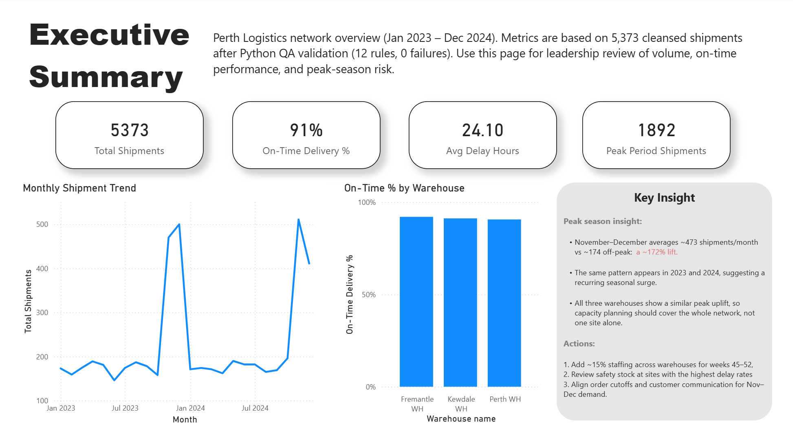
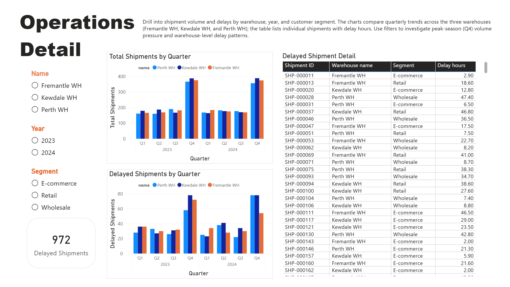
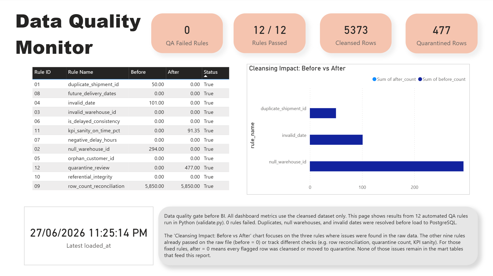

# Perth Logistics Operations Dashboard

End-to-end analytics portfolio: **Python ETL → PostgreSQL mart → Power BI**.

Synthetic shipment data for a three-warehouse logistics network. Raw extracts include duplicate IDs, null warehouse codes, and invalid dates. A Python cleansing and QA pipeline builds a trusted mart layer before reporting.

## Dashboard preview

| Executive Summary | Operations Detail | Data Quality |
|:---:|:---:|:---:|
|  |  |  |

Open the report in Power BI Desktop: [`powerbi/perth-logistics-dashboard.pbix`](powerbi/perth-logistics-dashboard.pbix)

## Data quality — before vs after

| Issue | Before (raw) | After (cleansed mart) |
|-------|-------------:|----------------------:|
| Duplicate shipment IDs | 50 | 0 |
| Null warehouse IDs | 294 | 0 |
| Invalid dates | 101 | 0 |
| **QA rules passed** | — | **12 / 12** |

- **5,373** shipments loaded to the mart
- **477** rows quarantined and excluded from BI

Full rule results: [`data/reports/qa_report.json`](data/reports/qa_report.json)

## Key findings (cleansed data)

- Network on-time delivery: **91.3%**
- Nov–Dec peak lift: **~172%** above non-peak months
- Q4 volume rises across all three warehouses; delay patterns differ by site

## Pipeline

```
generate_raw_data.py → cleanse.py → validate.py → export_cleansed.py
                              ↓
                    load_to_postgres.py → mart schema
                              ↓
                    Power BI (Import from PostgreSQL)
```

| Script | Purpose |
|--------|---------|
| `generate_raw_data.py` | Create synthetic raw CSV files |
| `cleanse.py` | Standardize fields; route bad rows to quarantine |
| `validate.py` | Run 12 QA rules; write `qa_report.json` |
| `export_cleansed.py` | Export cleansed CSVs |
| `load_to_postgres.py` | Load star-schema mart tables |
| `analyze.py` | Print summary metrics to the console |

## Reproduce locally

**Requirements:** Python 3.10+, PostgreSQL, Power BI Desktop (Windows)

```bash
git clone https://github.com/ssoyeonisgood/perth-logistics-dashboard.git
cd perth-logistics-dashboard
python3 -m pip install -r requirements.txt

cp .env.example .env  
createdb perth_ops
psql -d perth_ops -f sql/00_setup.sql

python3 scripts/generate_raw_data.py
python3 scripts/cleanse.py
python3 scripts/validate.py
python3 scripts/export_cleansed.py
python3 scripts/load_to_postgres.py
python3 scripts/analyze.py
```

**Power BI:** Connect to PostgreSQL (`localhost`, database `perth_ops`, schema `mart`, Import mode). Open the existing `.pbix` or rebuild from the mart tables.

## Project structure

```
scripts/              Python ETL and QA
sql/                  PostgreSQL mart DDL
data/raw/             Synthetic source files
data/cleansed/        Cleansed CSV outputs
data/reports/         qa_report.json
powerbi/              .pbix report and page screenshots
```

## Notes

- Synthetic data (`random_seed=42`) for portfolio demonstration only.
- `.env` is gitignored — use [`.env.example`](.env.example) as a template.
